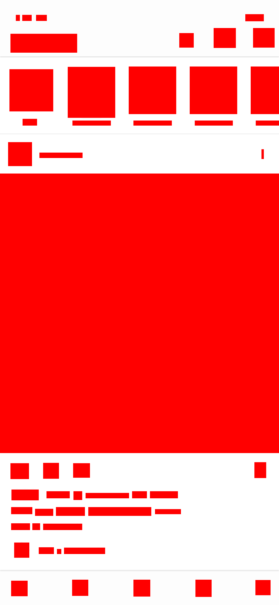

# img-items

[](https://www.npmjs.com/package/img-items)
[](https://travis-ci.com/kodie/img-items)
[](https://www.npmjs.com/package/img-items)
[](https://github.com/standard/standard)
[](license.md)

Finds individual items inside an image and gets their size/coordinates. Uses [Jimp] as an image processor so no native dependencies or binaries required.

## Example

| Source                       | Result                              |
:-----------------------------:|:------------------------------------:
|  |  |

```js
const Jimp = require('jimp')
const imgItems = require('img-items')

Jimp.read('assets/feed-example.png')
  .then(image => {
    return imgItems(image)
      .then(items => {
        items.forEach((item, i) => {
          image.scan(item.left, item.top, item.width, item.height, function (x, y, idx) {
            this.bitmap.data.writeUInt32BE(Jimp.cssColorToHex('#ff0000'), idx, true)
          })
        })

        return image.writeAsync('assets/feed-example-filled.png')
      })
  })
```

## Caveat

The larger the image and/or the more background colors defined to compare against, the slower the module will run. There are more than likely some things that could be approved upon to make it more efficient but it does work as is.

## Installation

```shell
npm install --save img-items
```

## Usage

`imgItems(image, options, callback)`

```js
const imgItems = require('img-items')

const options = {
  background: 0,
  backgroundThreshold: 5,
  gapThreshold: 5,
  sizeThreshold: 5
}

imgItems('my-image.jpg', options)
  .then(items => {
    // Do stuff with the array of items
  })
  .catch(err => {
    // Handle any errors
  })

// or use a callback
imgItems('my-image.jpg', options, (err, items) => {
  if (err) {
    // Handle any errors
    return
  }

  // Do stuff with the array of items
})
```

### Parameters

#### `image`

The image to scan for items. Accepts anything that [Jimp] accepts as a source image so file path, URL, buffer, or a Jimp instance.

#### `options`

An object with options you can set to tweak how items are found:

  * `background` (Default: `0`) - The color(s) that should be considered the background of the image. Accepts a string with a CSS hex color value (ex. `#FFFFFF`), an integer with a color hex (ex. `0xFFFFFFFF`), an array containing the before mentioned types, an integer set to `0` to use the top left pixel color, an integer set to `-1` to set the background color to either black or white depending on the average luminance of the image, or an integer from `1` to `10` to use that number of primary colors from the image. *(Keep in mind that the more colors that are defined here, the slower the module will run.)*

  * `backgroundThreshold` (Default: `5`) - An integer from `0` to `100` defining how close a color can be to the background color (using the [CIE76 Color Difference Formula](https://en.wikipedia.org/wiki/Color_difference#CIE76)) for it to be considered part of the background. `0` being an exact match.

  * `gapThreshold` (Default: `5`) - An integer defining how many pixels of background color before an item is considered it's own item.

  * `gapYThreshold` (Default: `null`) - The same as `gapThreshold` but only on the `Y` axis. (Setting to `null` will fallback to `gapThreshold`)

  * `gapXThreshold` (Default: `null`) - The same as `gapThreshold` but only on the `X` axis. (Setting to `null` will fallback to `gapThreshold`)

  * `sizeThreshold` (Default: `5`) - An integer defining how many pixels wide and high an item should be to make the cut. If an item has a width or height lower than this value it will be filtered out of the results.

  * `heightThreshold` (Default: `null`) - The same as `sizeThreshold` but only for the item's height. (Setting to `null` will fallback to `sizeThreshold`)

  * `widthThreshold` (Default: `null`) - The same as `sizeThreshold` but only for the item's width. (Setting to `null` will fallback to `sizeThreshold`)

#### `callback`

A function to run after the scan is finished that receives any errors that occurred as the first parameter and the items array as the second.

### Example Response

```js
[
  {
    left: 728,
    top: 42,
    right: 782,
    bottom: 62,
    width: 55,
    height: 21
  },
  {
    left: 47,
    top: 44,
    right: 58,
    bottom: 61,
    width: 12,
    height: 18
  },
  {
    left: 66,
    top: 44,
    right: 93,
    bottom: 61,
    width: 28,
    height: 18
  }
]
```

## License
MIT. See the [license.md file](license.md) for more info.

[Jimp]: https://www.npmjs.com/package/jimp
